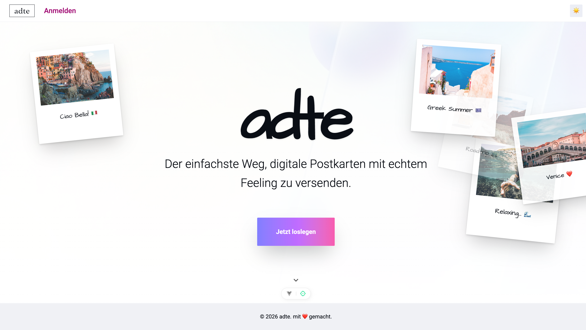
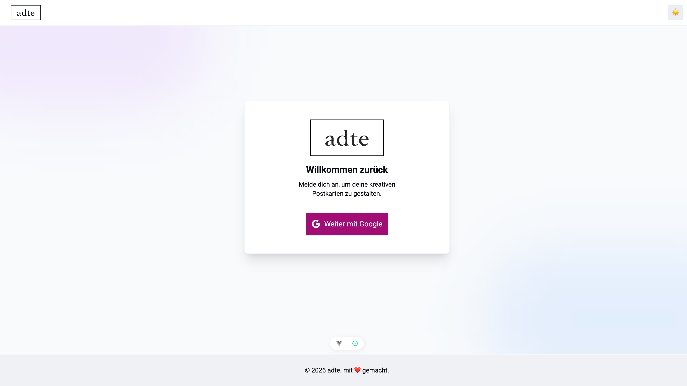

# img-postcardcreator


Ein Projekt von:

- [@JuKa2023](https://github.com/JuKa2023)
- [@SophiaIseli](https://github.com/SophiaIseli)

## Kurzbeschrieb

adte ist eine digitale Postkarten-Webanwendung, mit der Nutzer:innen persönliche Postkarten gestalten und per Share-Link und E-Mail teilen können. Der Fokus liegt auf individuellem Ausdruck, bewusster Gestaltung und einer reduzierten, ästhetischen Benutzeroberfläche.

## Projektidee

Eine Web-App, die digitale Postkarten wie kleine, persönliche Kunstwerke behandelt: Nutzer:innen stellen Bild, Text, Sticker, Audio und einen optionalen Standort-Stempel zusammen und teilen die Karte per Link oder E-Mail. Der Fokus liegt auf der kreativen Gestaltung und dem emotionalen Moment des Versendens.

## Screenshots





## Dokumentation

- Projektplan: `docs/plan.md`
- Prozess: `docs/process.md`

## Projekt online

- <https://adte.juka.dev>

## Features

- Registrierung & Login:
  - Anmeldung über Google OAuth (PocketBase)

- Inspiration & Einstieg:
  - Landing Page mit Beispiel-Postkarten aus lokalen Assets
  - Mood-Vorlagen (randomisierte Unsplash-Bilder) als Startpunkt

- Postkarten erstellen:
  - Hintergrundbild via Upload oder Mood-Vorlage
  - Zusätzliche Bilder/Overlays frei platzieren
  - Textfelder mit Schriftart, Farbe und Grösse
  - Emoji-Sticker (Emoji Picker)
  - Audio-Gruss aufnehmen
  - Standort-Stempel (Geolocation + Wetter) optional
  - Vorder-/Rückseite sowie Hoch-/Querformat

- Postkarten teilen & senden:
  - Individueller Share-Link zur Postkarte
  - Versand per E-Mail, optional zeitgesteuert (scheduled)

- Übersicht & Verwaltung:
  - Eigene Galerie mit Filtern (Entwurf/Gesendet)
  - Vorschau der Postkarte und Share-Link aus der Galerie

## Verwendete Technologien und API

- **Backend & Datenbank**: [PocketBase](https://pocketbase.io/) (Open Source Backend als Service)
  - Verwaltet Authentifizierung (OAuth2 mit Google), Datenbank (SQLite) und Dateispeicherung.

- **Frontend**:
  - **[Vue.js 3](https://vuejs.org/)**: Das progressive JavaScript Framework (verwendet Composition API & `<script setup>`).
  - **[TypeScript](https://www.typescriptlang.org/)**: Für statische Typisierung und bessere Entwickler-Experience.
  - **[Vite](https://vitejs.dev/)**: Next Generation Frontend Tooling.
  - **[Tailwind CSS](https://tailwindcss.com/)**: Ein Utility-First CSS Framework.

- **Listen & Tools**:
  - `vue-router`: Offizieller Router für Vue.js.
  - `pocketbase`: JavaScript SDK für die Backend-Integration.
  - `vue-sonner`: Toast-Benachrichtigungen.
  - `vue3-emoji-picker`: Emoji Picker für Sticker.

## Datenbankstruktur

Das Projekt verwendet ein PocketBase Backend mit einer Haupt-Collection:

### Postcards Collection (postcards)

Die `postcards` Collection speichert alle erstellten Postkarten.

- `front_image` (file): Das Bild der Postkarte.
- `audio` (file, optional): Optionale Sprachnachricht.
- `element_images` (file[], optional): Zusätzliche Bild-Uploads für freie Elemente.
- `message` (text): Die Textnachricht auf der Rückseite.
- `elements` (json): JSON-Array der frei platzierten Elemente (Text, Sticker, Bilder).
- `is_public` (bool): Sichtbarkeit (aktuell im Editor immer `true` gesetzt).
- `share_token` (text): Token für den Share-Link.
- `sent` (bool): Status, ob die Karte bereits per E-Mail versendet wurde.
- `scheduled_time` (date): Geplanter Versandzeitpunkt (optional).
- `recipient_email` (text): E-Mail-Adresse des Empfängers (optional).
- `is_landscape` (bool, optional): Ausrichtung der Karte.
- `canvas_width` / `canvas_height` (number, optional): Gespeicherte Canvas-Grösse.
- `theme_id` (text, optional): Hintergrund-Theme der Rückseite.
- `location` (text, optional): JSON-String für Standort/Weather-Stempel.
- `user` (relation): Referenz auf den User, der die Karte erstellt hat.

### Users Collection (users)

Die `users` Collection verwaltet die Benutzerkonten der Anwendung.

- `id` (text): Eindeutige ID des Benutzers.
- `email` (email): Die E-Mail-Adresse des Benutzers.
- `emailVisibility` (bool): Gibt an, ob die E-Mail-Adresse für andere sichtbar ist (Standard: False).
- `verified` (bool): Status der E-Mail-Verifizierung.
- `name` (text): Der Anzeigename des Benutzers.
- `avatar` (file): Das Profilbild des Benutzers.
- `created` (date): Zeitstempel der Erstellung (Automatisch).
- `updated` (date): Zeitstempel der letzten Änderung (Automatisch).

## Setup

Die App besteht aus einem Vue/Vite-Frontend und einem PocketBase-Backend. Der Frontend-Client erwartet einen laufenden PocketBase-Server.

### Voraussetzungen

- Node.js `^20.19.0 || >=22.12.0`
- PocketBase `0.28.3` (oder kompatibel)

### Lokale Entwicklung (empfohlen)

1. PocketBase herunterladen und die Binary `pocketbase` ins Projektroot legen.
2. PocketBase starten (nutzt `pb_data/`, `pb_hooks/` und `pb_migrations/` im Repo):

   ```sh
   PUBLIC_APP_URL=http://localhost:5173 ./pocketbase serve --http=127.0.0.1:8090
   ```

3. PocketBase Admin UI oeffnen und Admin-User erstellen:
   - http://127.0.0.1:8090/_/
4. OAuth Provider und Mailer konfigurieren:
   - Google OAuth im Admin UI aktivieren (Redirect-URL wie von PocketBase angezeigt)
   - SMTP/Mailer fuer geplante E-Mails setzen (Hook nutzt die Mailer-Einstellungen)
5. Env fuer das Frontend setzen:

   ```sh
   echo "VITE_POCKETBASE_URL=http://localhost:8090" > .env.local
   ```

6. Frontend starten:

   ```sh
   npm install
   npm run dev
   ```

### PocketBase Hinweise

- Collections und Hooks liegen im Repo (`pb_migrations/`, `pb_hooks/`). Starte PocketBase im Projektroot, damit alles geladen wird.
- Wenn du mit frischem `pb_data/` startest, pruefe im Admin UI, ob die Collection `postcards` vorhanden ist.

### Docker (Production Build)

```sh
docker build -t adte .
docker run -p 8080:80 adte
```

### Umgebungsvariablen

Die Anwendung verwendet folgende Umgebungsvariablen:

- `VITE_POCKETBASE_URL`: Basis-URL der PocketBase-Instanz (default: `window.location.origin`)
- `PUBLIC_APP_URL`: Öffentliche App-URL für E-Mail-Links im PocketBase Hook (default: `http://localhost:5173`)
- `PB_VERSION`: (Docker) PocketBase Version für das Image (default: `0.28.3`)

### Hinweise

- Für das Versenden geplanter Postkarten muss in PocketBase ein Mailer (SMTP) konfiguriert sein, da der Hook `pb_hooks/sendScheduledPostcards.pb.js` E-Mails verschickt.
- Der Standort-Stempel nutzt clientseitig Geolocation sowie die externen APIs BigDataCloud (Reverse Geo) und Open-Meteo (Wetter), jeweils ohne API-Key.

## Reflektion

Die Arbeit am Projekt **adte** war insgesamt eine sehr positive und lehrreiche Erfahrung. Besonders der konzeptionelle und gestalterische Teil des Projekts hat uns erneut viel Freude bereitet. Die Idee, digitale Postkarten bewusst persönlicher zu gestalten und Nutzer:innen einen kreativen Raum für individuelle Grüsse zu geben, war von Anfang an sehr motivierend.

Zu Beginn lag der Fokus stark auf der Konzeption und dem Design. Die Ausarbeitung des Screenflows, des Decision Trees sowie des visuellen Auftritts in Figma halfen dabei, das Projekt klar zu strukturieren und eine gemeinsame Vorstellung vom Endprodukt zu entwickeln. Die Gestaltung des Mockups in Light- und Dark-Mode war dabei besonders spannend, da viel Wert auf eine reduzierte, ästhetische und moderne Benutzeroberfläche gelegt wurde.

Während der Umsetzung zeigte sich jedoch, dass gewisse Designentscheidungen aus Figma in der Praxis angepasst werden mussten. Vor allem im Hinblick auf das responsive Design kam es zu Abweichungen: Im Hochformat auf dem Smartphone wirkten die Postkarten sehr klein und das ursprünglich geplante Layout funktionierte visuell nicht überzeugend. Aus diesem Grund wurde das Layout während der Entwicklungsphase angepasst. Rückblickend wäre es hilfreich gewesen, bereits in der Designphase mehr Zeit für User Testing einzuplanen, um solche Probleme früher zu erkennen.

Technisch gesehen verlief das Projekt grösstenteils reibungslos. Insgesamt traten nur wenige grössere Schwierigkeiten auf. Die grösste Herausforderung bestand darin, die individuell gestalteten Postkarten korrekt zu speichern und strukturiert in der Datenbank abzulegen. Besonders die Kombination aus Layout, Bildern, Texten und weiteren Elementen erforderte ein durchdachtes Datenmodell und mehrere Anpassungen während der Umsetzung.

Die Zusammenarbeit im Team funktionierte sehr gut. Aufgaben konnten klar aufgeteilt werden und unterschiedliche Stärken ergänzten sich sinnvoll. Der regelmässige Austausch half dabei, Probleme früh zu erkennen und gemeinsam Lösungen zu finden.

Insgesamt hat das Projekt gezeigt, wie wichtig die enge Verbindung zwischen Design und technischer Umsetzung ist. Kleine Anpassungen und Iterationen gehören zum Entwicklungsprozess dazu und tragen letztlich zu einem besseren Endresultat bei.

## Learnings

- Designentscheidungen aus Figma müssen in der Umsetzung kritisch überprüft werden, insbesondere im Hinblick auf Responsiveness  
- User Testing in einer frühen Phase kann helfen, spätere Layout-Anpassungen zu vermeiden  
- Die Speicherung komplexer, individuell gestalteter Inhalte in einer Datenbank erfordert eine saubere Datenstruktur  
- Ein klar definierter Screenflow erleichtert die Umsetzung erheblich  
- Eine gute Teamkommunikation reduziert technische und konzeptionelle Probleme  

## Schwierigkeiten

- Abweichungen zwischen Figma-Design und der tatsächlichen Darstellung auf mobilen Geräten  
- Anpassung des Layouts aufgrund zu kleiner Postkarten im Hochformat  
- Technische Umsetzung der Speicherung von Postkarten-Designs in der Datenbank  
- Fehlende Zeit für ausführliches User Testing in der Designphase  

### Benutzte Ressourcen

Während der Entwicklung des Projekts traten verschiedene technische Herausforderungen auf. In einem ersten Schritt griffen wir auf unsere Unterrichtsnotizen sowie das bereitgestellte Kursmaterial zurück. Diese bildeten die Grundlage für viele architektonische und konzeptionelle Entscheidungen.

Wenn das Kursmaterial keine ausreichende Lösung bot, nutzten wir zusätzliche Online-Ressourcen. Für backend- und datenbankbezogene Funktionen verwendeten wir hauptsächlich die offizielle Dokumentation von [PocketBase](https://pocketbase.io/docs/). Für die Umsetzung des Frontends mit Vue.js orientierten wir uns an der offiziellen [Vue.js-Dokumentation](https://vuejs.org/).

Zur Unterstützung bei konkreten Codeproblemen und zur Klärung von Verständnisfragen setzten wir KI-gestützte Tools wie [ChatGPT](https://chat.openai.com/) und [Claude](https://claude.ai/new) ein. Diese dienten insbesondere als Hilfe bei der Fehlersuche, beim Refactoring sowie beim Verständnis komplexerer Logik, ohne den eigentlichen Entwicklungsprozess vollständig zu automatisieren.

Für allgemeine Programmierkonzepte und Syntaxfragen griffen wir ergänzend auf Plattformen wie [W3Schools](https://www.w3schools.com/) zurück.

Im Bereich Design und Styling nutzten wir primär die offizielle Dokumentation von [Tailwind CSS](https://tailwindcss.com/), um Utility-Klassen korrekt einzusetzen und ein konsistentes Layout umzusetzen. Als visuelle Inspiration für das Design und die Benutzeroberfläche diente unter anderem die Plattform [Pinterest](https://www.pinterest.com/).

Bei komplexeren Fragestellungen oder konzeptionellen Unsicherheiten zogen wir bewusst menschliche Unterstützung hinzu. In diesen Fällen erhielten wir wertvolle Hilfe durch unsere Dozenten sowie durch Freunde mit Erfahrung in der Softwareentwicklung.

### Erweiterungsmöglichkeiten

- **Postkarten-Konversationen**
  - Beantworten empfangener Postkarten entweder mit:
    - einer Textnachricht oder
    - einer neuen Postkarte
  - Darstellung der Antworten in einer Chat-ähnlichen Ansicht (ähnlich zu WhatsApp)
  - Übersicht über alle ausgetauschten Postkarten und Reaktionen zwischen zwei Nutzer:innen

- **Erweiterte Medienunterstützung**
  - Unterstützung von Video-Postkarten
  - Integration von animierten Elementen (z. B. GIFs)

- **Persönliche Galerien**
  - Eigene Galerie empfangene Postkarten
  - Option, eine Galerie oder Postkarte zu veröffentlichen
  - Erneutes Versenden oder Herunterladen empfangener Postkarten

- **Community- & Sharing-Funktionen**
  - Veröffentlichen von Postkarten-Designs und Templates
  - Andere Nutzer:innen können Designs anpassen oder weiterentwickeln
  - Anzeige der ursprünglichen Urheber:innen bei wiederverwendeten Designs
  - Liken, Speichern oder Markieren von Favoriten

- **Interaktionen & Reaktionen**
  - Emoji-Reaktionen auf Postkarten
  - Kommentarfunktion (privat oder öffentlich)
  - Zustell- und Lesebestätigungen

- **Performance & Skalierbarkeit**
  - Bild- und Videokomprimierung für schnellere Uploads
  - Caching häufig genutzter Designs
  - Optimierung der Cloud-Speicherung

## Project Setup

```sh
npm install
```

### Compile and Hot-Reload for Development

```sh
npm run dev
```

### Type-Check, Compile and Minify for Production

```sh
npm run build
```
